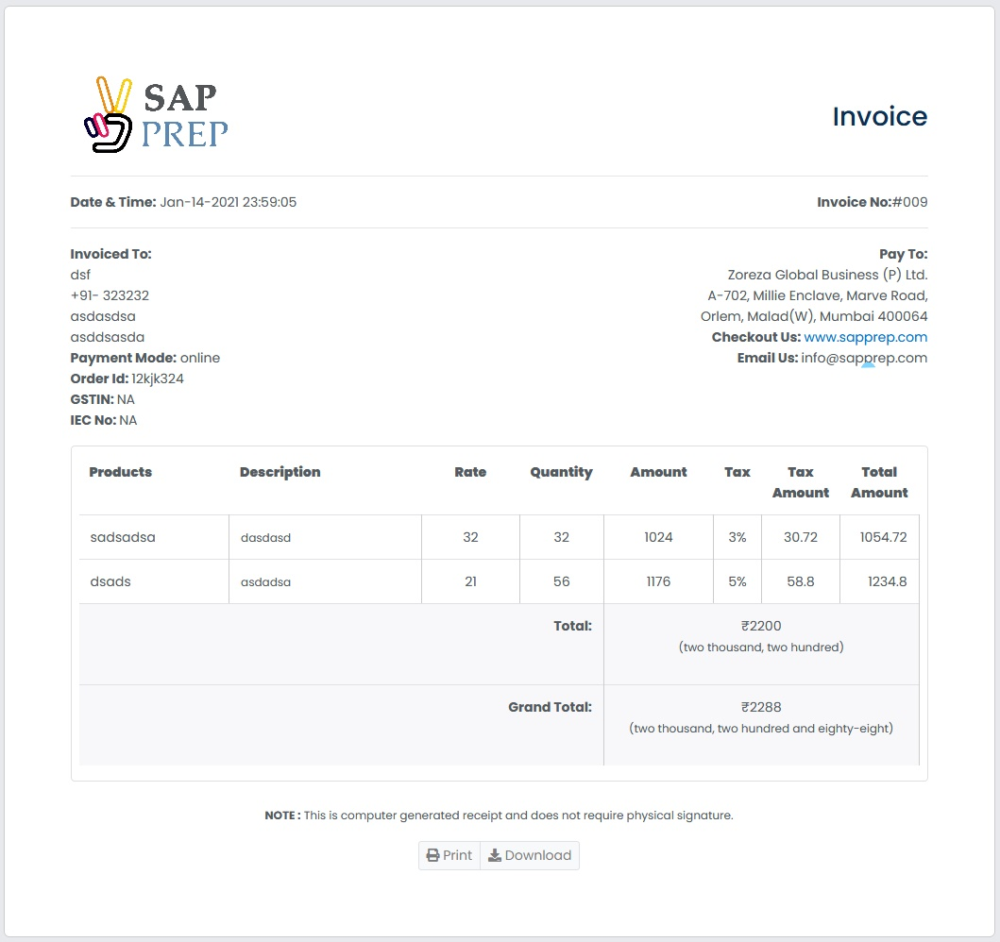

<h1 align="center">Simple_python_invoice_Builder</h1>

### About this project

A collection of loading animations written entirely in css.
Each animation is limited to a small subset of css properties in order
to avoid expensive painting and layout calculations.
Animations will help you to save time when creating your webpages! 
These responsive layouts are pure css and easy to customize including colors.



I've posted links below to some fantastic articles that go into this
in a lot more detail.

### Install

```
git clone https://github.com/amanjhurani/Invoice-Generator-in-Python.git
```
extract file
And go to image file and change logo
run
```
python invoice.py
```

```
now enjoy
```

### Usage

### Customising

fully customizable invoice, what ever you want to change you can change easy .
like :-
1) Logo
2) Invoice template
now ENJOY


### Browser support


IE 11  | Firefox 36 | Chrome 41 | Safari 8
------ | ---------- | --------- | --------
| ✔ | ✔| ✔ | ✔     | ✔ | ✔    | ✔ | ✔

### Contributing

Pull requests are welcome!

In a separate tab run the code to see you change. Open `print_invoice.html`
in a browser to see your invoice .

